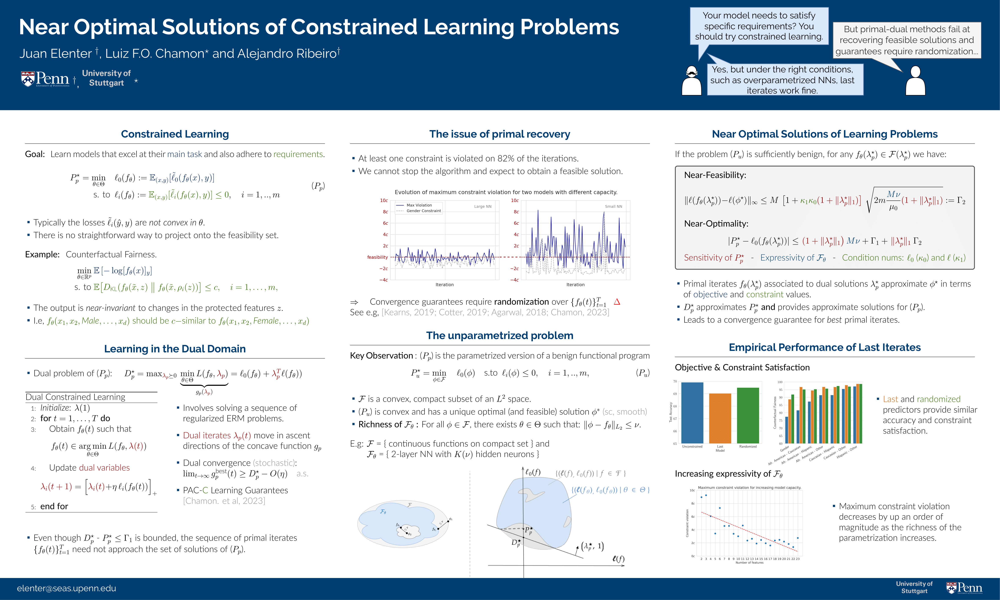

# Near-Optimal Solutions of Constrained Learning Problems 

[PAPER](https://arxiv.org/abs/2403.11844) // [POSTER](https://iclr.cc/media/PosterPDFs/ICLR%202024/18193.png?t=1714760882.5786023)

## Abstract

With the widespread adoption of machine learning systems, the need to curtail their behavior has become increasingly apparent. This is evidenced by recent advancements towards developing models that satisfy robustness, safety, and fairness requirements. These requirements can be imposed (with generalization guarantees) by formulating constrained learning problems that can then be tackled by dual ascent algorithms. Yet, though these algorithms converge in objective value, even in non-convex settings, they cannot guarantee that their outcome is feasible. Doing so requires randomizing over all iterates, which is impractical in virtually any modern applications. Still, final iterates have been observed to perform well in practice. In this work, we address this gap between theory and practice by characterizing the constraint violation of Lagrangian minimizers associated with optimal dual variables, despite lack of convexity. To do this, we leverage the fact that non-convex, finite-dimensional constrained learning problems can be seen as parametrizations of convex, functional problems. Our results show that rich parametrizations effectively mitigate the issue of feasibility in dual methods, shedding light on prior empirical successes of dual learning. We illustrate our findings in fair learning tasks.

## Project Page Under Construction

🚧 This project page is currently under construction. Stay tuned for updates! 🚧

## Authors

- [Juan Elenter](https://www.seas.upenn.edu/~elenter/)
- [Luiz F.O. Chamon](https://luizchamon.com/)
- [Alejandro Ribeiro](https://scholar.google.com/citations?user=7mrPM4kAAAAJ&hl=en)

## Table of Contents

- [Introduction](#introduction)
- [Installation](#installation)
- [Usage](#usage)
- [Contributing](#contributing)
- [License](#license)

## Introduction

## Installation

Under construction.

## Usage

Under construction.

## Contributing

Under construction.

## License

Under construction.
